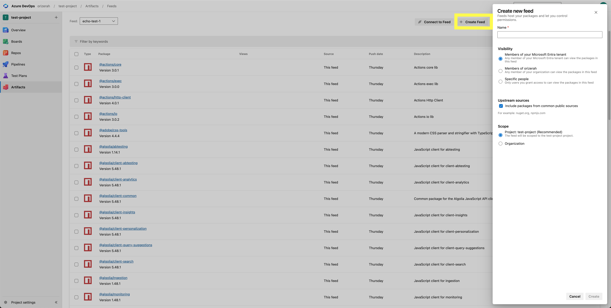
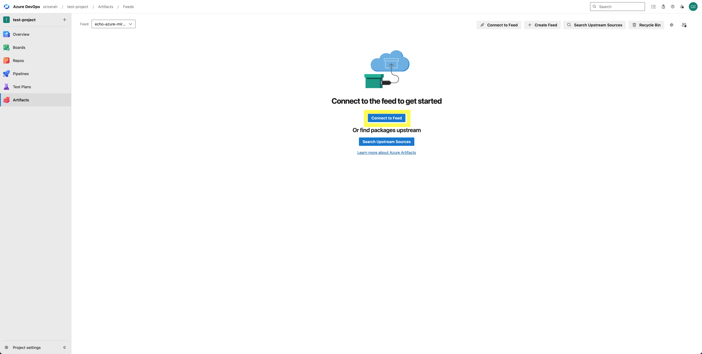
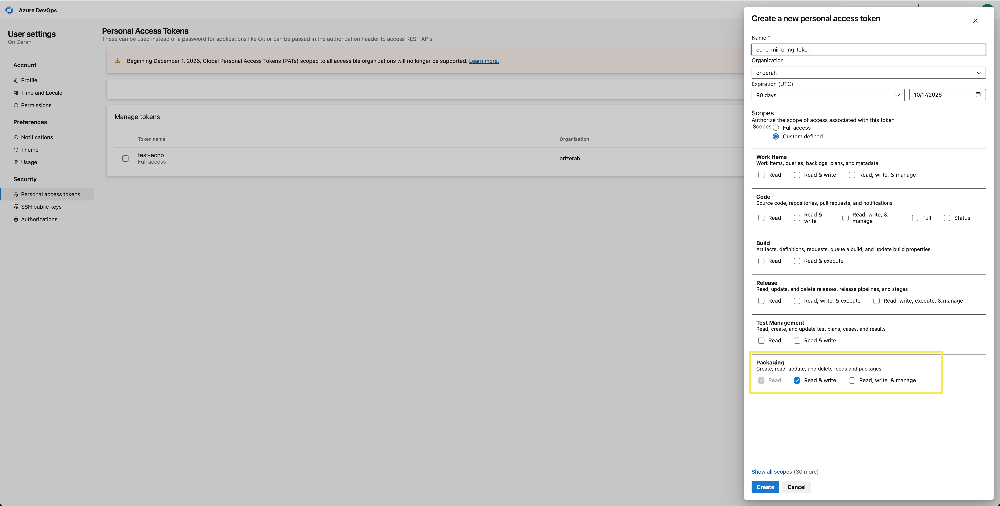

# `library-mirror`

A GitHub Action that mirrors Echo libraries into an Azure Artifacts feed you own, as a step in your existing workflow. Your builds install versions that are safe and patched, with no extra infrastructure to run.

For each library version you list, the action will:

* **Pull** it from Echo, where malicious and vulnerable versions are blocked automatically.
* **Publish** it to your feed byte-for-byte, with version metadata intact.
* **Skip** versions already in your feed, so re-runs and scheduled syncs are safe.

## How Echo keeps libraries safe

Echo maintains a catalog of libraries kept free of known malware and patched against known vulnerabilities. When the action pulls a version, that protection is applied automatically — unsafe versions are blocked and never reach your feed. Every version that lands in your feed cleared Echo's checks first.

## Supported ecosystems

| Language ecosystem | Status |
|---|---|
| npm | ✅ Supported |
| PyPI | ✅ Supported |

## Supported destination registries

| Registry | Status |
|---|---|
| Azure Artifacts | ✅ Supported |

## Usage

Add a step that references the action. This example mirrors both ecosystems from library lists committed to your repo:

```yaml
- uses: buildecho/actions/library-mirror@v1
  with:
    ecosystem: all             # npm | pypi | all (default: all)
    echo-key: ${{ secrets.ECHO_LIBRARIES_KEY }}
    azure-token: ${{ secrets.AZURE_ARTIFACTS_PAT }}
    npm-packages-file: packages/npm.txt
    azure-npm-registry: https://pkgs.dev.azure.com/ORG/PROJECT/_packaging/FEED/npm/registry/
    pypi-packages-file: packages/pypi.txt
    azure-pypi-upload: https://pkgs.dev.azure.com/ORG/PROJECT/_packaging/FEED/pypi/upload/
    azure-pypi-index: https://pkgs.dev.azure.com/ORG/PROJECT/_packaging/FEED/pypi/simple/
```

Set `ecosystem: npm` or `ecosystem: pypi` to mirror one; only that ecosystem's inputs are then required. Pin to `@v1` for the latest release, or to a specific `@vX.Y.Z` to freeze a version. A complete workflow is in [`.github/workflows/mirror-example.yml`](.github/workflows/mirror-example.yml).

You can also pass libraries inline instead of from a file:

```yaml
- uses: buildecho/actions/library-mirror@v1
  with:
    ecosystem: all
    echo-key: ${{ secrets.ECHO_LIBRARIES_KEY }}
    azure-token: ${{ secrets.AZURE_ARTIFACTS_PAT }}
    npm-packages: |
      lodash@4.17.21
      left-pad
    pypi-packages: |
      requests==2.32.3
      urllib3
    azure-npm-registry: https://pkgs.dev.azure.com/ORG/PROJECT/_packaging/FEED/npm/registry/
    azure-pypi-upload: https://pkgs.dev.azure.com/ORG/PROJECT/_packaging/FEED/pypi/upload/
    azure-pypi-index: https://pkgs.dev.azure.com/ORG/PROJECT/_packaging/FEED/pypi/simple/
```

An inline `*-packages` input takes precedence over its `*-packages-file`.

## Setting up your Azure Artifacts feed

The action publishes into a feed you create and own. This is a one-time setup in the Azure DevOps UI.

**1. Create or pick a feed.** In your Azure DevOps project, go to **Artifacts** → **Create Feed**, name it, and choose its visibility.



**2. Get the registry URLs.** On the feed, click **Connect to feed** and open the **npm** and **pip/twine** tabs. Each shows the URL for that ecosystem, which map to the action's inputs:

| Azure Artifacts UI tab | Action input |
|---|---|
| npm → registry URL | `azure-npm-registry` |
| pip/twine → upload URL | `azure-pypi-upload` |
| pip/twine → index URL | `azure-pypi-index` |



**3. Create a Personal Access Token.** In Azure DevOps, go to the user icon (top right) → **Personal access tokens** → **New Token**, scoped to **Packaging → Read & write**. Set an expiration your team is comfortable rotating.



**4. Store your credentials as GitHub secrets.** In your repo, go to **Settings** → **Secrets and variables** → **Actions** and add `ECHO_LIBRARIES_KEY` (your Echo Libraries key) and `AZURE_ARTIFACTS_PAT` (the token from the previous step).

## Keeping libraries available to your builds

The action runs a sync: it copies the libraries you list into your feed, rather than resolving them on demand the way a pull-through cache would. A version that has not been synced yet will not be in your feed when a build asks for it. To keep developers from being blocked:

- **Add a public fallback (recommended).** Add an upstream source on your feed (**Feed settings** → **Upstream sources** → **Add upstream**) so anything not yet mirrored still resolves from the public registry. Builds are never blocked while your Echo coverage grows. Echo is building a way to detect libraries resolved this way and fold them into your next sync, so they come from Echo going forward.
- **Or sync before you build.** If you'd rather every library resolve through Echo, keep your library list current and run the sync ahead of your builds, for example on a schedule or as an early job.

## Library list format

One library per line. Lines starting with `#` and blank lines are ignored. A bare name mirrors versions resolved from Echo (`versions: all | latest`); a pinned line mirrors that exact version.

```
# npm
lodash
@types/node
react@18.2.0

# pypi
requests
urllib3==2.2.2
```

## Inputs

| Input | Required | Default | Description |
|-------|----------|---------|-------------|
| `ecosystem` | no | `all` | `npm`, `pypi`, or `all` |
| `echo-key` | yes | | Echo Libraries key (`ACCESS_KEY`), used only to pull from Echo |
| `azure-token` | yes | | Azure DevOps PAT with Packaging read & write, used only to push to Azure |
| `npm-packages` | npm¹ | | npm library list, inline (one per line) |
| `npm-packages-file` | npm¹ | | Path to the npm library list |
| `pypi-packages` | pypi¹ | | PyPI library list, inline (one per line) |
| `pypi-packages-file` | pypi¹ | | Path to the PyPI library list |
| `azure-npm-registry` | npm | | Azure npm registry URL |
| `azure-pypi-upload` | pypi | | Azure PyPI upload URL |
| `azure-pypi-index` | pypi | | Azure PyPI simple index URL |
| `versions` | no | `all` | `all` or `latest`, for bare library names |
| `max-retries` | no | `4` | Pull attempts before giving up |
| `retry-base-seconds` | no | `5` | Base delay for exponential retry backoff |
| `dry-run` | no | `false` | Resolve and pull, but do not publish |
| `strict` | no | `false` | Exit non-zero if any version is blocked, not only on failure |

Inputs marked `npm` or `pypi` are required only when that ecosystem is active. For each active ecosystem, supply exactly one of the `¹` library-list inputs (inline or file).

## License

Apache License 2.0. See [LICENSE](../LICENSE) for details.
